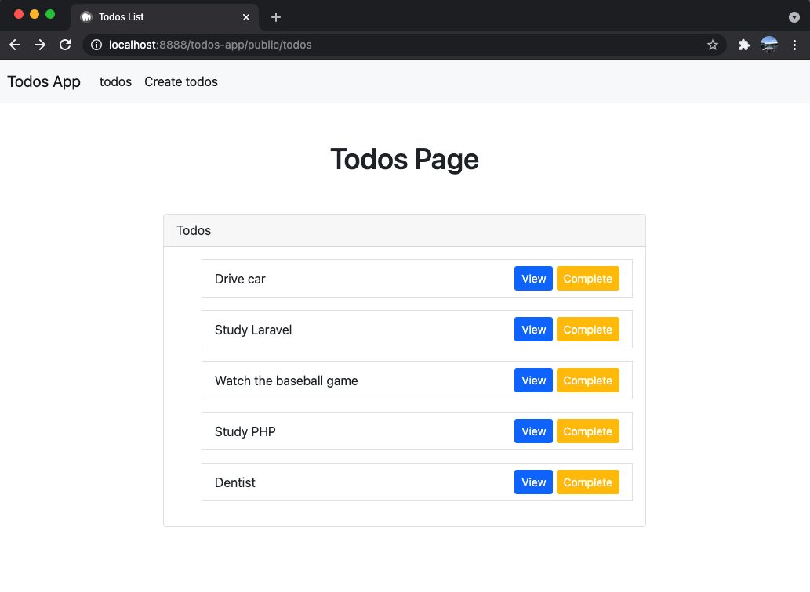

# Todos-App

## Functions
Create, edit, delete and complete functions here. 
Complete function is to get users know if the todo is completed or not.

## Enviroment
MAMP : 6.3 
PHP : 7.3.24 
Laravel : 8.40.0 
MySQL : 5.7.32 
OS : Mac 11.2.3

## References
https://www.udemy.com/course/best-laravel/
